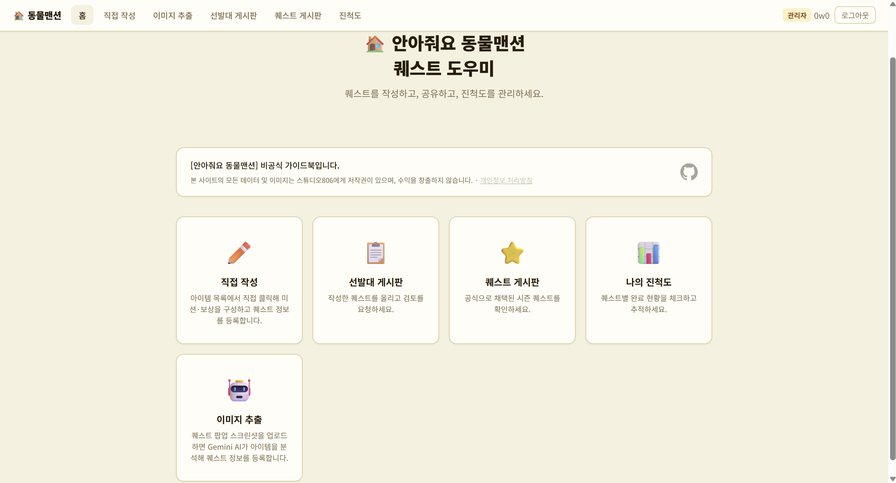
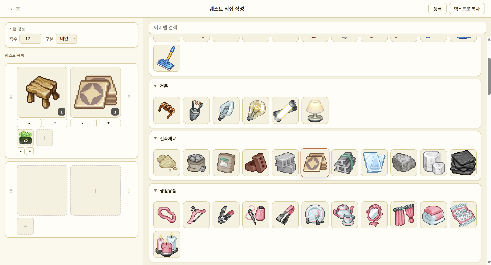
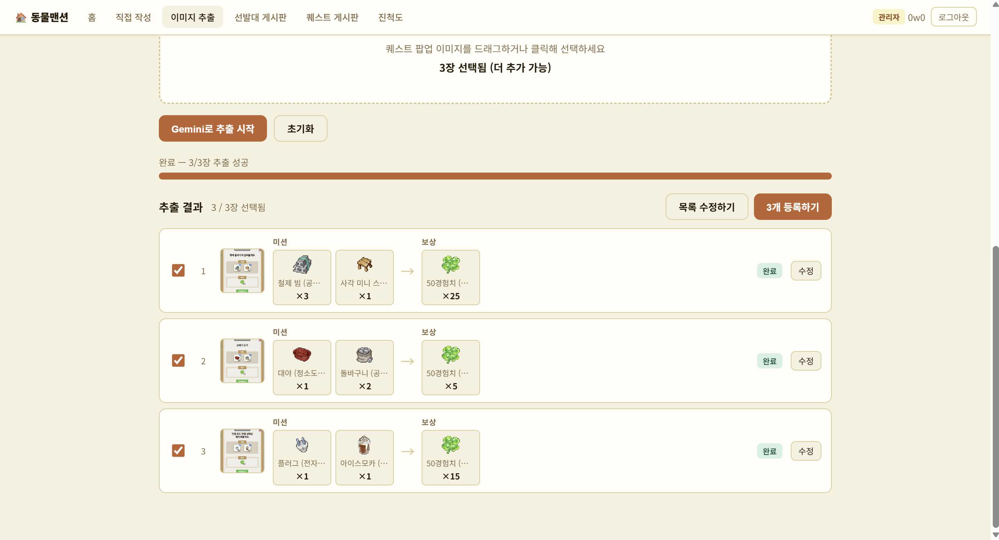
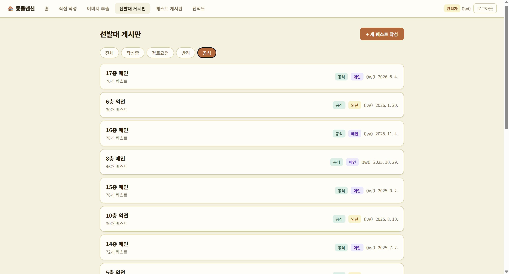
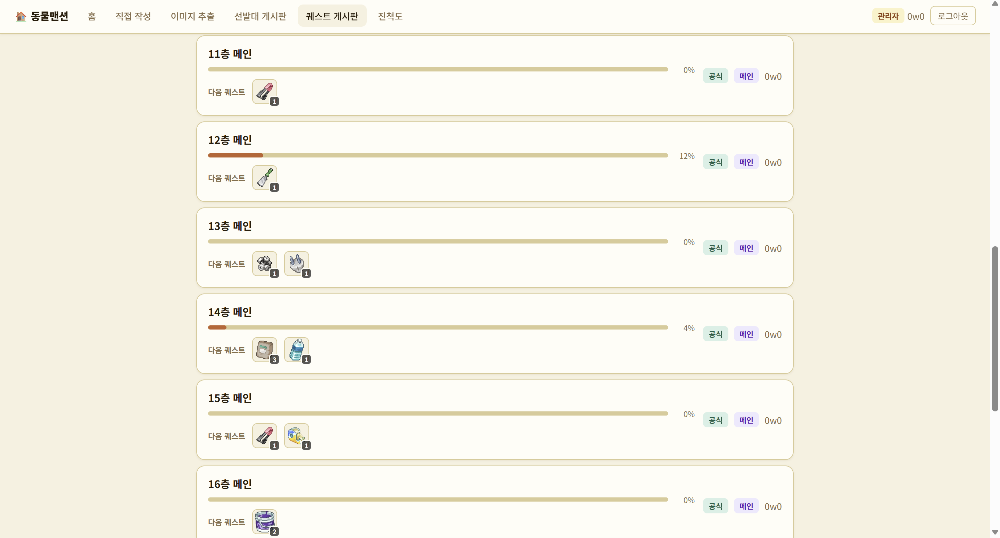
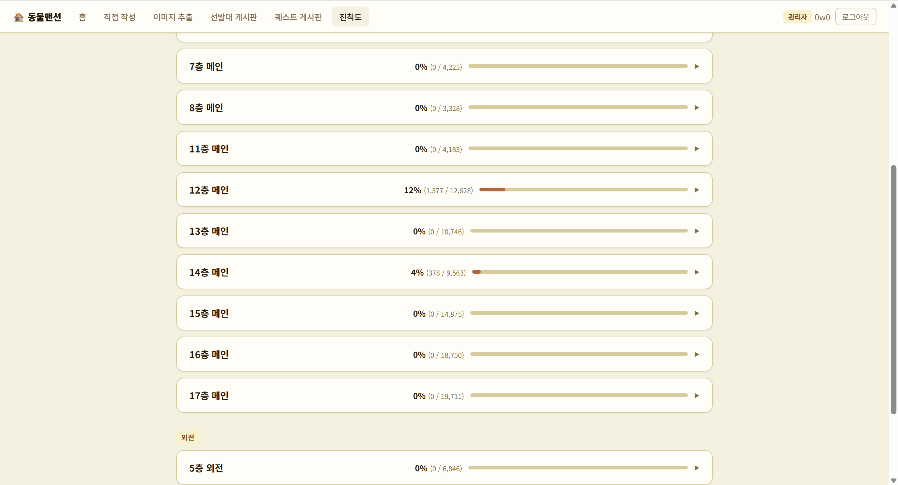

# 🏠 안아줘요 동물맨션 퀘스트 도우미

안아줘요 동물맨션의 선발대 퀘스트 정보를 작성하고, 공유하고, 진척도를 관리할 수 있는 비공식 팬 가이드 웹 애플리케이션입니다.

> **비공식 팬 프로젝트입니다.** 게임 내 모든 데이터 및 이미지의 저작권은 스튜디오806에 있으며, 본 프로젝트는 수익을 창출하지 않습니다.

---

<!-- 📸 사진 설명: 홈 화면 전체 캡처. 메뉴 카드(직접 작성 / 이미지 추출 / 선발대 게시판 / 퀘스트 게시판 / 진척도)가 모두 보여야 함 -->



---

## 주요 기능

### 퀘스트 직접 작성
아이템을 검색해 미션 슬롯과 보상 슬롯을 채우고 퀘스트를 등록합니다.

<!-- 📸 사진 설명: 직접 작성 페이지. 아이템 선택 피커가 열려 있고 슬롯이 채워진 상태 -->


---

### 이미지 자동 추출 (Gemini AI)
게임 퀘스트 팝업 스크린샷을 업로드하면 Google Gemini AI가 아이템과 수량을 자동으로 인식해 퀘스트 정보를 채워줍니다.

<!-- 📸 사진 설명: 이미지 추출 페이지. 스크린샷이 업로드된 후 추출 결과 목록이 표시된 상태 (미션 아이템 → 보상 아이템 행이 여러 개 보여야 함) -->


---

### 선발대 게시판
다른 유저가 등록한 퀘스트를 층/타입별로 필터링해 조회합니다. 검토 요청 / 작성 중 상태로 구분됩니다.

<!-- 📸 사진 설명: 선발대 게시판. 층수 필터가 적용되어 퀘스트 카드들이 나열된 상태 -->


---

### 공식 퀘스트 게시판
검수가 완료된 공식 퀘스트 정보를 층/타입별로 확인합니다.

<!-- 📸 사진 설명: 공식 퀘스트 게시판. 1층~N층 메인/외전 퀘스트가 카드 형태로 보이는 상태 -->


---

### 진척도 관리
공식 퀘스트 목록을 기반으로 클리어한 퀘스트를 체크하고 진척률을 확인합니다.

<!-- 📸 사진 설명: 진척도 페이지. 퀘스트 체크리스트와 진척률 바가 보이는 상태 -->


---

## 기술 스택

| 구분 | 사용 기술 |
|------|-----------|
| 서버 | Node.js, Express |
| 프론트엔드 | Vanilla HTML / CSS / JS |
| 인증 | Google OAuth 2.0 |
| AI 추출 | Google Gemini API (`gemini-2.0-flash`) |
| 배포 | Fly.io (Docker) |

## 시작하기

### 환경 변수

`.env` 파일을 생성하고 아래 값을 채워주세요.

```env
GOOGLE_CLIENT_ID=...
GOOGLE_CLIENT_SECRET=...
GEMINI_API_KEY=...
SESSION_SECRET=...
```

### 실행

```bash
npm install
npm start
```

## 개인정보 처리방침

Google OAuth 로그인 시 Google 계정 ID, 이름, 이메일, 프로필 사진 URL을 수집합니다.
자세한 내용은 서비스 내 [개인정보 처리방침](public/pages/privacy.html)을 확인해 주세요.

## 라이선스

이 프로젝트의 코드는 MIT 라이선스를 따릅니다. 단, 게임 내 아이템 이미지 등 저작물은 스튜디오806에 귀속되며 본 저장소에 포함되지 않습니다.
